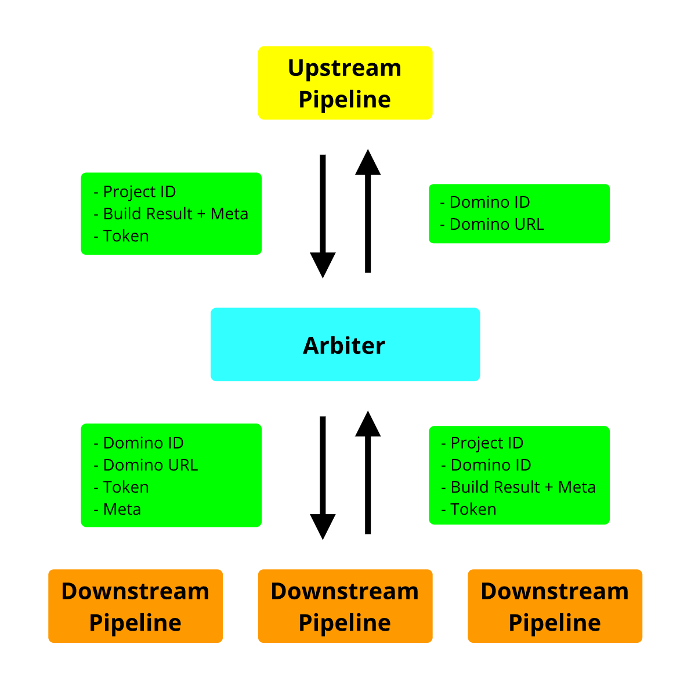

# DominoCI

A prototype to trigger CI build systems upon upstream changes

## Definitions

- **DominoArbiter** - The central orchestrator 
- **Domino** - A code repository with a single triggerable pipeline
- **DominoDependency** - A project's pipeline may rely on artifacts from another project
- **DominoEvent** - When a project wants to notify all downstream projects that it has built new artifacts
- **DominoResult** - When a project reports back its status to DominoArbiter
- **DominoEventTree** - A tree of pipeline dependencies and events from different projects. 

## Rules

- There is only one root Domino in the DominoTree.
- If the root Domino's pipeline fails, the DominoArbiter is not notified
- If the root Domino's pipeline succeeds, the DominoArbiter is sent the following:
  - A token proving the Domino's identity
  - The pipeline status -> "SUCCESS"
  - Metadata - Branch / Tag / Name of Pipeline / Commit sha / Last commit message
  - Links to repo, pipeline page, and owners file
  - List of artifacts that were generated
- The DominoArbiter creates a global DominoEventTree event ID with the status and metadata given
- The DominoArbiter checks for the Domino's project dependencies
  - Filtering by Tag / Branch could be done to only notify when certain criteria met
- If there are no dependencies, nothing is done
- If there are dependencies, each child Domino is sent:
  - The metadata and artifacts from the parent Domino
  - A token verifying the DominoArbiter to the Domino
  - The parent event ID + a unique sub id to respond to
- The info is sent to a webhook that starts a build pipeline and passes the metadata in as variables
    - On Jenkins, use [Generic Webhook Trigger plugin](https://wiki.jenkins.io/display/JENKINS/Generic+Webhook+Trigger+Plugin)
    - On Gitlab, use [Triggers](https://docs.gitlab.com/ee/ci/triggers/#adding-a-new-trigger)
    - Other platforms coming soon
- To capture successes and fails, add sections to the Domino pipeline config:
    - On Jenkins, use [Post section](https://github.com/jenkinsci/pipeline-model-definition-plugin/wiki/Running-multiple-steps#cleaning-up-after-yourself)
    - On Gitlab, use [When section](https://docs.gitlab.com/ee/ci/yaml/#when)
- When the child Domino's pipeline finishes, it sends back to the DominoArbiter:
  - A token proving the Domino's identity
  - The pipeline status -> "SUCCESS, FAIL"
  - Metadata - Branch / Tag / Name of Pipeline / Commit sha / Last commit message
  - Links to repo, pipeline page, and owners file
  - If the pipeline succeeded, a list of artifacts that were generated
  - The parent event ID + unique sub id as given by DominoArbiter
- If the child Domino's pipeline fails, then the tree will not continue
- If the child Domino's pipeline succeeds, then the dependencies of the child Domino will be sent the next set of metadata

## Optional Parts
- Auxillary webhooks - for notification of external platforms (ie IRC, Slack)
- Badges - for including in README.md indicating build status
- Hierarchical IDs - parent id/descendent 1/descendent 2
- Recursive loops - prevent DominoEventTree loops with projects that depend on each other

## User Interface

### User settings

- Login / Signup
- User edit
- PREFERRED -> use SSO / Github / Gitlab

### Project settings

- Create project
- Edit project
- Delete project
- Add / remove dependency to project
- Regenerate token
- Add / remove user to project
- Test DominoEventTree connections

### Project page

- Go to repo
- Last successful build combo
- Domino build logs
  - Summary (statistical xx% children failed)
  - First level
  - Tree explore
- Dependency tree
- Owners / contact details
- Click to go to pipeline / logs

### Project search

- Find by project url / name

## Database structure

### ProjectWebhooks

### Project

### ProjectTokens

### DominoEventTree

### DominoEvent

### DominoResult

### User

### UserPermissions

